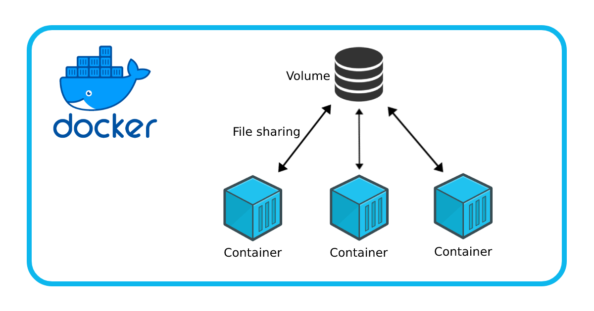
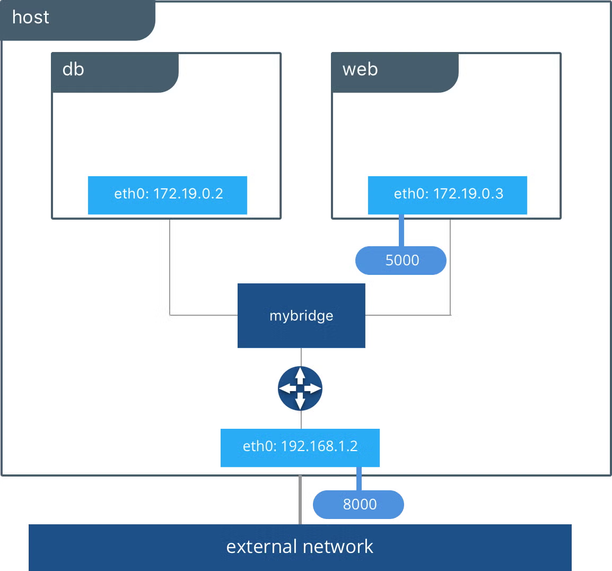
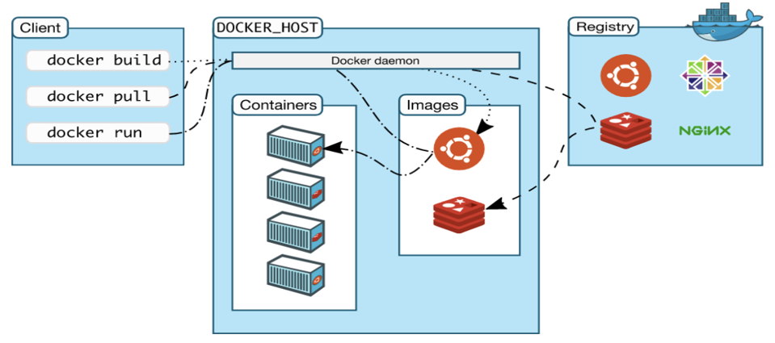

# Docker

Tecnología de contenedores que permite empaquetar aplicaciones y sus dependencias en un solo objeto llamado contenedor.

Technology of containers that allows you to package applications and their dependencies into a single object called a container.

Son ligeros, portables y se pueden ejecutar en cualquier entorno que soporte Docker.

Docker only works on Linux, but it can run on Windows and MacOS using a lightweight virtual machine.

## Basics Concepts

- **Dockerfile**: Text file with instructions to build a Docker image. It contains the commands to assemble the image, not have a file extension.

- **Docker Image**: Read-only template used to create containers. Compiled version of the Dockerfile. Image are built from Dockerfiles and can be shared via Docker Hub or other registries.

- **Docker Container**: Running instance of a Docker image. Final object that runs in Docker. Through the image you can create multiple containers

- **Docker Hub**: Public repository for Docker images. It allows you to share and download images

- **Docker Daemon**: Background service that manages Docker containers. It is responsible for building, running, and managing containers. It listens for API requests and can communicate with the Docker CLI or other tools.

**Docker CLI**: Command-line interface for interacting with Docker. It allows you to run commands to manage containers, images, and other Docker resources.

**Docker Compose**: Tool for defining and running multi-container Docker applications. It uses a YAML file to configure the services, networks, and volumes needed for the application. With Docker Compose, you can start and stop all the containers in your application with a single command.

**Docker Swarm**: Native clustering and orchestration tool for Docker. It allows you to manage a cluster of Docker nodes as a single virtual system. With Docker Swarm, you can deploy and manage services across multiple Docker hosts.

**Docker Registry**: Service for storing and distributing Docker images. It can be public (like Docker Hub) or private (self-hosted). A registry allows you to push and pull images to and from it.

**Docker Volume**: Persistent storage for Docker containers. Volumes are used to store data that needs to persist even if the container is removed. They can be shared between containers and are managed by Docker.

**Docker Network**: Virtual network that allows containers to communicate with each other. Docker provides several network drivers (bridge, host, overlay) to create different types of networks for your containers.

**Docker Compose File**: YAML file used to define and configure multi-container Docker applications. It specifies the services, networks, and volumes needed for the application. The file is typically named `docker-compose.yml` and can be used with the `docker-compose` command to manage the application.

**Docker Stack**: Collection of services that make up an application in Docker Swarm. A stack is defined by a `docker-compose.yml` file and can be deployed to a Swarm cluster. It allows you to manage multiple services as a single unit.

**Docker Context**: A named set of parameters that define a Docker environment. It allows you to switch between different Docker environments (local, remote, cloud) easily. You can create, list, and manage contexts using the `docker context` command.

**Docker Secrets**: Secure storage for sensitive data (like passwords, API keys) used by Docker services. Secrets are encrypted and can be accessed only by the services that need them. They are managed by Docker Swarm and can be created, listed, and removed using the `docker secret` command.

**Docker Configs**: Configuration files used by Docker services. They allow you to store non-sensitive data (like configuration files, scripts) that can be shared between services. Configs are managed by Docker Swarm and can be created, listed, and removed using the `docker config` command.

**Docker Healthcheck**: Mechanism to check the health of a running container. It allows you to define a command that Docker will run periodically to determine if the container is healthy or not. If the command fails, Docker can take action (like restarting the container) based on the health status.

**Docker BuildKit**: Advanced build subsystem for Docker that improves the performance and capabilities of the `docker build` command. It allows for parallel builds, better caching, and support for new features like build secrets and build contexts. BuildKit can be enabled by setting the `DOCKER_BUILDKIT=1` environment variable.

**Docker Compose Override File**: A file used to override or extend the configuration of a Docker Compose file. It allows you to define additional settings or modifications without changing the original `docker-compose.yml` file. The override file is typically named `docker-compose.override.yml` and is automatically used by Docker Compose when running commands.

**Dockerfile Best Practices**: Guidelines for writing efficient and maintainable Dockerfiles. Some best practices include:

- Use a .dockerignore file to exclude unnecessary files from the build context.
- Minimize the number of layers in the image by combining commands.
- Use official base images from Docker Hub when possible.
- Keep images small by removing unnecessary packages and files.
- Use multi-stage builds to separate build and runtime dependencies.

## Docker Commands

```bash
docker --version
```

[Docker hub Httpd](https://hub.docker.com/_/httpd)

- Docker pull

```bash
docker pull httpd
```

**docker**: Command-line tool for interacting with Docker.

**pull**: Command to download a Docker image from a registry (like Docker Hub) to your local machine.

**httpd**: The name of the Docker image to download. In this case, it is the official Apache HTTP server image.

**latest**: The tag of the image to download. If not specified, Docker will pull the `latest` tag by default. The `latest` tag usually refers to the most recent stable version of the image.

**docker pull httpd:2.4**: Command to download a specific version (2.4) of the Apache HTTP server image. If you want to download a different version, you can specify the desired tag.

- Docker run

```bash
docker run -p 8080:80 -d httpd
```

**docker**: Command-line tool for interacting with Docker.
**run**: Command to create and start a new container from an image
**-p 8080:80**: Maps port 8080 on the host to port 80 in the container. This allows you to access the web server running in the container from your host machine. 8080 is the host port and 80 is the container port.
**-d**: Runs the container in detached mode, meaning it runs in the background and does not block the terminal.
**httpd**: The name of the Docker image to use. In this case, it is the official Apache HTTP server image. If the image is not available locally, Docker will pull it from Docker Hub.

```bash
docker run -p 8080:80 -d --name my-httpd httpd:2.4
```

**--name my-httpd**: Assigns a name (my-httpd) to the container. This makes it easier to manage the container later, as you can refer to it by name instead of its container ID.

- Docker ps: Command to list all running containers

```bash
docker ps
```

**docker ps**: Command to list all running containers. It shows the container ID, image name, command, creation time, status, ports, and names of the running containers.

**docker ps -a**: Command to list all containers, including stopped ones. It shows the same information as `docker ps`, but includes containers that are not currently running.

**docker ps -q**: Command to list only the container IDs of all running containers. It is useful for scripting and automation.

**docker ps -aq**: Command to list only the container IDs of all containers, including stopped ones. It is useful for scripting and automation.

**docker ps -l**: Command to show the most recently created container. It shows the same information as `docker ps`, but only for the last created container.

**docker ps -n 5**: Command to show the last 5 created containers. It shows the same information as `docker ps`, but only for the last 5 created containers.

**docker ps -n 5 -q**: Command to show the last 5 created containers, but only their IDs. It is useful for scripting and automation.

**docker ps -s**: Command to show the size of each container. It shows the same information as `docker ps`, but includes the size of each container.

**docker ps -s -q**: Command to show the size of each container, but only their IDs. It is useful for scripting and automation.

**docker ps -s -l**: Command to show the size of the most recently created container. It shows the same information as `docker ps`, but only for the last created container.

**docker ps -s -n 5**: Command to show the size of the last 5 created containers. It shows the same information as `docker ps`, but only for the last 5 created containers.

**docker ps -s -n 5 -q**: Command to show the size of the last 5 created containers, but only their IDs. It is useful for scripting and automation.

**docker ps -s -n 5 -l**: Command to show the size of the last 5 created containers, but only for the last created container. It shows the same information as `docker ps`, but only for the last created container.

- nginx

```bash
docker run -p 8080:80 -d nginx
```

- Docker container

**Docker container ls**: List all running containers

```bash
docker container ls
```

**docker container ls -a**: List all containers, including stopped ones

```bash
docker container --help
```

```bash
docker container inspect <container_id>
docker inspect <container_id>
```

**inspect**: Command to get detailed information about a container. It shows the container's configuration, state, network settings, and more.

**<container_id>**: The ID or name of the container you want to inspect. You can find the container ID or name using the `docker ps` command. Can be also a name, for example `db-db-1`.

```bash
docker inspect <container_id> | grep -i env
docker container inspect <container_id> | grep -i env
```

**grep -i env**: Filters the output of the `docker inspect` command to show only lines containing the word "env" (case-insensitive). This is useful for finding environment variables set in the container.

```bash
docker rm <container_id or name>
docker container rm <container_id or name>
```

**rm**: Command to remove a container. It deletes the container from your local machine. You can only remove stopped containers, so make sure to stop the container first if it is running.
**<container_id or name>**: The ID or name of the container you want to remove. You can find the container ID or name using the `docker ps` command.

## docker container run vs docker run

The `docker container run` command is a more explicit way to run a container, while `docker run` is a shorthand version. Both commands achieve the same result, but `docker container run` is more verbose and can be used to clarify the context of the command.

docker run es un alias de docker container run. Por lo tanto, ambos comandos son equivalentes y producen el mismo resultado.

```bash
docker container run -p 8080:80 -d --name my-httpd httpd:2.4
```
Is the same as:

```bash
docker run -p 8080:80 -d --name my-httpd httpd:2.4
```

`docker container ls` is an alias for `docker ps`. Both commands list the running containers, but `docker container ls` is more explicit and can be used to clarify the context of the command.

```bash
docker container ls
```
Is the same as:

```bash
docker ps
```

## stop | Detener

```bash
docker stop <container_id|container_name>
```

**docker stop**: Command to stop a running container. It sends a SIGTERM signal to the container, allowing it to gracefully shut down. If the container does not stop within a certain time (default is 10 seconds), Docker sends a SIGKILL signal to forcefully terminate it.

## Start | Iniciar

```bash
docker start <container_id|container_name>
```
**docker start**: Command to start a stopped container. It starts the container and runs the command specified in the Dockerfile or the command used to create the container.


## Interactive mode | Modo interactivo

```bash
docker exec container_id|container_name command
```
**docker exec**: Command to run a command in a running container. It allows you to execute commands inside the container's environment.
**container_id|container_name**: The ID or name of the container where you want to run the command. You can find the container ID or name using the `docker ps` command.
**command**: The command you want to run inside the container. This can be any command that is available in the container's environment.

To interact with a container and execute commands into container, you can use the `-it` option when running the container. This option combines two flags:
- `-i`: Keeps STDIN open even if not attached. This allows you to send input to the container.
- `-t`: Allocates a pseudo-TTY. This creates a terminal interface for the container, allowing you to interact with it as if it were a regular terminal.

if you have a container running, for example, and nginx container called `my-nginx`

```bash
docker run -p 8081:80 --name my-nginx -d nginx
```

- You can execute a command inside the container using the following command:

```bash
docker exec my-nginx ls
```
- You can create a new file inside the container

```bash
docker exec my-nginx touch /tmp/test.txt
```
- You can list the files inside the container using the following command:

```bash
docker exec my-nginx ls -l /tmp
```

This will list the files and directories inside the container's file system.

- You can access the container's shell using the following command:

```bash
docker exec -it my-nginx bash
```
o

```bash
docker exec -it my-nginx sh
```

To exit the container's shell, you can use the `exit` command.

## Ports | Puertos

You can expose ports when running a container using the `-p` option. This option maps a port on the host machine to a port on the container.

```bash
docker run -p host_port:container_port image_name
```
- **host_port**: The port on the host machine that you want to map to the container's port. This is the port you will use to access the service running in the container.
- **container_port**: The port on the container that the service is running on. This is the port that the service inside the container is listening to.
- **image_name**: The name of the Docker image you want to run. This is the image that contains the service you want to access.

- **docker run -p 8080:80 -d nginx**: This command runs an Nginx container and maps port 8080 on the host to port 80 on the container. You can access the Nginx server by navigating to `http://localhost:8080` in your web browser.

You can also specify a range of ports to expose using the `-p` option. For example, to expose ports 8080 to 8090 on the host and map them to ports 80 to 90 on the container, you can use the following command:

```bash
docker run -p 8080-8090:80-90 -d nginx
```
- **8080-8090**: The range of ports on the host machine that you want to map to the container's ports.
- **80-90**: The range of ports on the container that the service is running on. This is the range of ports that the service inside the container is listening to.

You can also expose a random port on the host machine by using the `-P` option. This option automatically maps a random port on the host to the container's port.

```bash
docker run -P -d --name random-nginx nginx
```
- **-P**: Automatically maps a random port on the host to the container's port. This is useful if you don't care about the specific port number and just want to access the service.

To find out which port was assigned, you can use the `docker ps` command or the `docker port` command. For example, to find out which port was assigned to the Nginx container, you can use the following command:

```bash
# docker port <container_name|container_id>
docker port random-nginx
# or
# docker container port <container_name|container_id>
docker container port random-nginx
```

You can also specify the protocol to use when exposing ports. By default, Docker uses TCP, but you can specify UDP or both using the following syntax:

```bash
docker run -p host_port:container_port/protocol image_name
```
- **protocol**: The protocol to use when exposing the ports. This can be `tcp`, `udp`, or `tcp/udp`. If not specified, Docker uses TCP by default.
- **docker run -p 8080:80/tcp -d nginx**: This command runs an Nginx container and maps port 8080 on the host to port 80 on the container using TCP.

```bash
docker run -p 8080:80/udp -d nginx
```

This command runs an Nginx container and maps port 8080 on the host to port 80 on the container using UDP.

You can also specify the IP address to bind the port to using the following syntax:

```bash
docker run -p ip_address:host_port:container_port image_name
```

- **ip_address**: The IP address on the host machine that you want to bind the port to. This is useful if you have multiple network interfaces and want to bind the port to a specific one.
- **host_port**: The port on the host machine that you want to map to the container's port.
- **container_port**: The port on the container that the service is running on. This is the port that the service inside the container is listening to.

```bash
docker run -p 1.2.3.4:8080:80 nginx
```

## Logs | Registros

To view the logs of a container, you can use the `docker logs` command. This command shows the standard output and standard error streams of the container.

```bash
# docker logs <container_id|container_name>
docker logs my-nginx
```

To stay see the logs in real-time, you can use the `-f` option. This option follows the logs and shows new log entries as they are written.

- **-f**: Follows the logs and shows new log entries as they are written. This is useful for monitoring the logs in real-time.

```bash
docker logs -f my-nginx
```
- **--tail**: Shows only the last N lines of the logs. This is useful for limiting the amount of log output displayed.

```bash
docker logs --tail 10 my-nginx
```
- **--since**: Shows logs since a specific time. This is useful for filtering logs based on time.

```bash
docker logs --since 2023-10-01T00:00:00 my-nginx
```
- **--timestamps**: Shows timestamps for each log entry. This is useful for understanding when each log entry was written.

```bash
docker logs --timestamps my-nginx
```
- **--details**: Shows additional details for each log entry. This is useful for understanding the context of each log entry.

```bash
docker logs --details my-nginx
```
- **--no-log-prefix**: Disables the log prefix for each log entry. This is useful for customizing the log output.

```bash
docker logs --no-log-prefix my-nginx
```

## Inspect | Inspeccionar 

To inspect a container, you can use the `docker inspect` command. This command shows detailed information about the container, including its configuration, state, network settings, and more.

```bash
docker inspect <container_id|container_name>
```
- **docker inspect**: Command to get detailed information about a container. It shows the container's configuration, state, network settings, and more.
- **<container_id|container_name>**: The ID or name of the container you want to inspect. You can find the container ID or name using the `docker ps` command.

```bash
docker inspect my-nginx
```

Image inspect

```bash
docker inspect <image_id|image_name>
```
## Environment Variables | Variables de entorno

To set environment variables when running a container, you can use the `-e` option. This option allows you to specify environment variables that will be available inside the container.

```bash
docker run -e ENV_VAR_NAME=value image_name
```
- **ENV_VAR_NAME**: The name of the environment variable you want to set. This is the variable that will be available inside the container.
- **value**: The value of the environment variable you want to set. This is the value that will be assigned to the variable inside the container.
- **image_name**: The name of the Docker image you want to run. This is the image that contains the service you want to access.

- MySQL example:

```bash
docker run -p 3307:3306 -e MYSQL_ROOT_PASSWORD=ROOT -e MY_SQL_DATABASE=test --name my-mysql-3 -d mysql
```

- **MYSQL_ROOT_PASSWORD**: The name of the environment variable that sets the root password for the MySQL server. This is a required variable when running a MySQL container.
- **my-secret-pw**: The value of the environment variable that sets the root password for the MySQL server. This is the password that will be used to access the MySQL server.

## Container without services | Contenedores sin servicios

There are containers that do not run any services, such as containers that only run a shell or a command. To run a container without any services, you can use the `-it` option to start an interactive shell inside the container. This allows you to run commands inside the container without starting any services.

To run a container without any services, you can use the `-it` option to start an interactive shell inside the container. This allows you to run commands inside the container without starting any services.

```bash
docker run -it --name my-container ubuntu
```
- **-it**: Combines the `-i` and `-t` options to keep STDIN open and allocate a pseudo-TTY. This allows you to interact with the container's shell.
- **--name my-container**: Assigns a name (my-container) to the container. This makes it easier to manage the container later, as you can refer to it by name instead of its container ID.
- **ubuntu**: The name of the Docker image to use. In this case, it is the official Ubuntu image. If the image is not available locally, Docker will pull it from Docker Hub.


### Note:

If the container is using many flags you can change for example ```docker run -d -i -t --name my-container ubuntu``` to ```docker run -dit --name my-container ubuntu```
- **-d**: Runs the container in detached mode, meaning it runs in the background and does not block the terminal.
- **-i**: Keeps STDIN open even if not attached. This allows you to send input to the container.
- **-t**: Allocates a pseudo-TTY. This creates a terminal interface for the container, allowing you to interact with it as if it were a regular terminal.

```bash
docker run -dit --name my-container ubuntu
```


## Volumes | Volúmenes

Volumes are used to store data that needs to persist even if the container is removed. They can be shared between containers and are managed by Docker.



docker volume
Usage:  docker volume COMMAND

Manage volumes

Commands:
  create      Create a volume
  inspect     Display detailed information on one or more volumes
  ls          List volumes
  prune       Remove unused local volumes
  rm          Remove one or more volumes

Run 'docker volume COMMAND --help' for more information on a command.

- To create a volume, you can use the `docker volume create` command. This command creates a new volume that can be used by containers.

```bash
docker volume create my-volume
```

Options:

-d, --driver string   Specify volume driver name
-o, --opt map[=value]   Set driver-specific options

```bash
docker volume create docker-curso
docker-curso
root@sublime-dev-B365M-DS3H:/home/sublime-dev/dev/docker/docker-personal# docker volume inspect docker-curso
[
    {
        "CreatedAt": "2025-05-21T14:52:35-05:00",
        "Driver": "local",
        "Labels": null,
        "Mountpoint": "/var/lib/docker/volumes/docker-curso/_data",
        "Name": "docker-curso",
        "Options": null,
        "Scope": "local"
    }
]
```

- To list all volumes, you can use the `docker volume ls` command. This command shows all the volumes available on your local machine.

```bash
docker volume ls
```

- To inspect a volume, you can use the `docker volume inspect` command. This command shows detailed information about the volume, including its configuration, state, and mount point.

```bash
docker volume inspect my-volume
```

- To remove a volume, you can use the `docker volume rm` command. This command removes the specified volume from your local machine.

```bash
docker volume rm my-volume
```

- To remove all unused volumes, you can use the `docker volume prune` command. This command removes all volumes that are not currently used by any containers.

```bash
docker volume prune
```

- To create a volume and mount it to a container, you can use the `-v` option when running the container. This option allows you to specify the volume to mount and the path inside the container where it will be mounted.

```bash
docker run -v my-volume:/data -d my-image
```
- **my-volume**: The name of the volume to mount. This is the volume that will be used by the container.
- **/data**: The path inside the container where the volume will be mounted. This is the directory where the volume will be accessible inside the container.
- **my-image**: The name of the Docker image to run. This is the image that contains the service you want to access.

```bash
docker run -v my-volume:/data -d --name my-container my-image
```

- MySQL example:

```bash
docker run -p 3307:3306 -e MYSQL_ROOT_PASSWORD=ROOT -e MY_SQL_DATABASE=test --name my-mysql-3 -v my-volume:/var/lib/mysql -d mysql
```

### Share files between containers | Compartir archivos entre contenedores

To share files between containers, you can use volumes. 

Volumes allow you to share files and directories between containers, making it easy to share data and configuration files.

To share a volume between two containers, you can use the `-v` option when running both containers. This option allows you to specify the same volume for both containers, making it easy to share files and directories.

```bash
docker run -v my-volume:/data -d --name container1 my-image
docker run -v my-volume:/data -d --name container2 my-image
```
- **my-volume**: The name of the volume to mount. This is the volume that will be used by both containers.
- **/data**: The path inside the container where the volume will be mounted. This is the directory where the volume will be accessible inside both containers.
- **container1**: The name of the first container to run. This is the first container that will use the shared volume.
- **container2**: The name of the second container to run. This is the second container that will use the shared volume.

Ejemplo:

```bash
docker volume create my-volume
docker inspect my-volume
# Take the route and create file named test.txt
# If the volume is created in the path /var/lib/docker/volumes/my-volume/_data
# You can create a file named test.txt in the path /var/lib/docker/volumes/my-volume/_data
nano /var/lib/docker/volumes/my-volume/_data/test.txt
# Or you can create the file inside the container
docker run -v my-volume:/data -it --name container1 ubuntu
# Inside the container
# Create the file
touch /data/test.txt
# Exit the container
exit
docker run -v my-volume:/data -d --name container2 ubuntu
# Inside the container
docker exec -it container2 bash
# Inside the container
ls -l /data
# You should see the file test.txt
```

## Manual Volumes | Volúmenes manuales

To create a manual volume, you can use the `-v` option when running the container. This option allows you to specify the path on the host machine where the volume will be created.

```bash
docker run -v /path/on/host:/path/in/container -d my-image
```
- **/path/on/host**: The path on the host machine where the volume will be created. This is the directory on the host machine that will be used as a volume.
- **/path/in/container**: The path inside the container where the volume will be mounted. This is the directory inside the container that will be used as a volume.
- **my-image**: The name of the Docker image to run. This is the image that contains the service you want to access.

```bash
docker run -v /home/sublime-dev/dev/docker/docker-personal:/data -d --name my-container ubuntu
```
- **/home/sublime-dev/dev/docker/docker-personal**: The path on the host machine where the volume will be created. This is the directory on the host machine that will be used as a volume.
- **/data**: The path inside the container where the volume will be mounted. This is the directory inside the container that will be used as a volume.
- **my-container**: The name of the container to run. This is the name of the container that will use the volume.
- **ubuntu**: The name of the Docker image to run. This is the image that contains the service you want to access.

```bash
docker run -dit -v /home/sublime-dev/dev/docker-personal/conceptos/volumes:/docker-curso --name ubuntu-volume ubuntu
```
- **/home/sublime-dev/dev/docker-personal/conceptos/volumes**: The path on the host machine where the volume will be created. This is the directory on the host machine that will be used as a volume.
- **/docker-curso**: The path inside the container where the volume will be mounted. This is the directory inside the container that will be used as a volume.
- **ubuntu-volume**: The name of the container to run. This is the name of the container that will use the volume.
- **-dit**: Runs the container in detached mode, meaning it runs in the background and does not block the terminal.

We can install packages inside the container and they will be saved in the host machine.

```bash
docker run -dit -v /home/sublime-dev/dev/docker-personal/conceptos/volumes:/docker-curso --name ubuntu-volume ubuntu
```

```bash
docker exec -it ubuntu-volume bash
# Inside the container
apt-get update
apt-get install -y python3
# Create a file inside the container with the name main.py and content print("Hello World")
# Inside the container
cd /docker-curso
# Install nano
apt-get install -y nano
# Create the file
nano main.py
# Inside the file
print("Hello World")
# Save the file
# Exit the container
exit
```

```bash
apt-get update
apt-get install -y python3
```
And we can execute the command inside the container.

```bash
docker exec -it ubuntu-volume python3 /docker-curso/main.py
```

```bash
python3
>>> print("Hello World")
# Hello World
```

## Networks | Redes

Allow the container has Intertnet

Allow the comunication througth containers, to comunications the container to container



Is a layer of virtual network that allow the containers comunication entre si and external world (host, internet, other machines). 

### Networks Types | Tipos de Redes

1. `bride` (Puente) - Default - Por defecto:

```bash
docker network ls
```

Default network when a red is not spesified. Docker create a virtual bride in the host and connect the containers in the network to this bride

The containers in the same `bride` can comunicate throught si by his name of container (Docker provide solution of DNS inside). To comunicate with the external world, the trafic pass throught the bride and the network interface of the host

UseCases: Ideal for single-host application, where containers need to communicate with each other, like web application with the database container

Example: 

```bash
docker run --name my-app-container --network bride my-app-image
docker run --name my-db-container --network bride my-db-image
```

`my-app-container` can communicate with `my-db-container` using the name `"my-db-container"`

If you don't spesify `--network bride`, automatically is unida to the network `bride` docker defauld 

2. `Host` (Host):

A container that use the host network share the host's network stak of Docker. The container don't have his network space isolated

The container use host IP directily and ports of the same machine of the host. If a service inside the container hear 80 port, is available of the 80 port in the host

Offer better rendimiento of network-red because delete a virtual layer. Lose network isolate thougth container and host and can be there a security risk or port conflicts

```bash
docker run --name my-host-app --network host my-app-image
```

If `my-app-image` expose 80 port, is available in http://ip_host:80

3. None (Ningunaa):

A container with the none network don't have network interface configure.

The container is isoled of the network. Cannot communicate with other containers and don't have to comunicate with the external world

UseCase: Containers that not require network connection with de network-red, like file generation, outline calculos or other containers can connect to other network interfaces created mannuality

```bash
docker run --name my-isolated-task --network none my-task-image
```

### Ejemplo:

```bash
docker network create docker-curso
```

```bash
docker network ls
# Inspeccionamos la red
docker inspect <network_id|network_name> 
# Get IPAM > Config > Gateway IP
ping GatewayIP
```

```bash
# Create a container
docker run -dit --network docker-curso --name ubuntu-network ubuntu
# Create a second container
docker run -dit --network docker-curso --name ubuntu-network-2 ubuntu
```

If do docker inspect you can see the container ubuntu-network and ubuntu-network-2 is into the same network and have IPs distinct-distintas

Now can to exec it container to make ping

```bash
docker exec -it ubuntu-network bash
# Update and install ping
apt-get update
apt-get install iputils-ping -y
apt-get install net-tools -y
```

Now can to do ping into containers

```bash
ping IP
# or
ping container_name # Only is working when the name is asignet when running
ping ubuntu-network-2
```

Ejemplo Host: 

```bash
docker run -d --network host --name nginx-host nginx
```

The container run on port 80 of host

## Docker Images



Throug images can create final object using the images to building. 

In Object Oriented Programing we can use class to create objects, well, the images is like a class, thougth class or image we can create multiples objets or applications

To work with images we have create a file named Dockerfile, in this file configure the caracteristics to have the containers, defined the instructions to add atributes and caracteristics that we can to have the container

Next we can compile a image and next create a container based in this image

If go to docker hub, see images 

## First image

If create and execute ubuntu container 

```bash
docker run -it ubuntu
```
If we run `python3` or other command is not working 

Go to create a ubuntu with de package installed

[Dockerfile](./docker-images/ubuntu/Dockerfile)

Use `docker build` to build our image

```bash
docker build -t ubuntu-with-python .
```

And now to run a container with our image use

```bash
docker run -it ubuntu-with-python
```


### Coping Files

To copy file use de directive `COPY`

We can use this command

```bash
docker build -t ubuntu-with-python:v2 .
# run
docker run -it ubuntu-with-python:v2
```

### Environments and Arguments

Other thing can we do is define environment and arguments

Environments variables containt information and can be access with de SO

Arguments is variable and can be change in build-moment

To use arguments is with
```bash
docker build -t ubuntu-with-python:v3 --build-arg="TEXT_EDITOR=vim"
```

### Execute services

Execute services

Command RUN only is execute when the build the image

To execute commands to run or create a container

```Dockerfile
CMD ["nginx", "-g", "daemond off;"]
```

```bash
docker build -t ubuntu-with-python:v5
docker run -it ubuntu-with-python:v5
```
if add CMD when execute docker run -it don't have output because the container is execute command CMD


### Entripoint vs CMD


Directive CMD, this directive is posible override-sobreescribir
If I do build image, then run a container executing a command this command don't should execute
Example: 

```bash
docker build -t ubuntu-with-python:v5
docker run -d -p 8082:80 --name ubuntu-python-v7 ubuntu-with-python:v7 ls -al
# Logs
docker logs ubuntu-python-v7
# total 16
# drwxr-xr-x 2 root root 4096 May 22 13:16 .
# drwxr-xr-x 1 root root 4096 May 22 13:19 ..
# -rw-rw-r-- 1 root root  646 May 22 13:14 Dockerfile
# -rw-rw-r-- 1 root root   30 May 22 04:54 main.py
```

`ENTRYPOINT` is not override

```bash
ENTRYPOINT ["nginx", "-g", "daemon off;"]
```
### Docker python


### Docker Hub

1. Crear cuenta en docker hub

2. Crear un repositorio llamado ubuntu-python

3. Hacer login

```bash
docker login
```

4. Hacer un tag con la imagen generada

```bash
docker image tag image-name TAG
docker image tag ubuntu-python:v12 sublimedev/ubuntu-python:v1
```

5. Subimos la imagen a docker hub

```bash
docker push sublimedev/ubuntu-python:v1
```

### Docker Node

[Dockerfile](./docker-images/node/Dockerfile)

We can create a image with

```bash
docker build -t ubuntu-node:v1 .
# show the images
docker image ls
# Run container
docker run -d -p 3000:3000 --name ubuntu-node-1 ubuntu-node:v1
# See the logs
docker logs ubuntu-node-1
# Entry to container
docker exec -it ubuntu-node-1 bash
# Execute 
ls -l
```

## Docker Compose

Docker Compose: Orquestación Simplificada de Aplicaciones Multi-Contenedor

Local orquestator 

Is a tool of Docker allow to define and execute multi-containers application. En lugar de execute containers individual with `docker run`, Docker compose you allow define all services, networks and volumes of your application on a file YAML (tipically called `docker-compose.yml`). Then with a one command you can up, stop, stale, etc. all your application

If modified the `docker-compose.yml` and we execute again `docker compose up` Docker Compose reconoce that file is changed and re-build the image and container

`docker-compose.yml`

```yml
version: '3.8' # Specifie the version format file

services: #Define services of your containers
  web:
    image: nginx:latest
    port:
      - "80:80"
    volumes:
      - "./nginx.conf:/etc/nginx/nginx.conf"
    depends_on:
      - app # web depends on the app is ready
  app:
    build: . # Build image from Dockerfile on the actual directory
    ports:
      - "5000:5000"
    environment:
      DATABASE_URL: "mysql://user:password@db/mydatabase"
    networks:
      - app-network

  db:
    image: mysql:8.0
    environment:
      MYSQL_ROOT_PASSWORD: "mysecretpassword"
      MYSQL_DATABASE: "mydatabase"
    volumes:
      - db_data:/var/lib/mysql
    networks:
      - app-network

volumes: #Definition of the volumes
  db_data:

networks:
  app-network:
    driver: bride # Optional: default driver is bride

```

Secciones Clave:
version: Especifica la versión del formato de archivo Compose. Es importante porque las características y la sintaxis pueden variar entre versiones (e.g., 3.8 es una versión común y recomendada).
services: Define los contenedores que forman tu aplicación. Cada entrada bajo services representa un servicio.
image: La imagen de Docker a usar (e.g., nginx:latest, mysql:8.0). Docker la descargará si no la tienes localmente.
build: Especifica la ruta a un Dockerfile para construir una imagen personalizada para el servicio. Si se usa . significa el Dockerfile en el directorio actual.
ports: Mapea puertos del contenedor al host (HOST_PORT:CONTAINER_PORT).
volumes: Monta volúmenes para persistir datos o para compartir archivos entre el host y el contenedor. Puede ser un volumen con nombre (volume_name:/path/in/container) o un bind mount (./host/path:/path/in/container).
environment: Define variables de entorno dentro del contenedor (clave-valor).
depends_on: Declara dependencias entre servicios. Los servicios listados aquí se iniciarán antes que el servicio actual. Importante: Solo garantiza el orden de inicio, no que el servicio dependiente esté completamente "listo" o que su aplicación interna haya arrancado.
networks: Conecta un servicio a una o varias redes definidas en la sección networks. Si no se especifica, se conectará a la red por defecto creada por Compose.
container_name: Asigna un nombre específico al contenedor. Si no se define, Compose generará un nombre.
restart: Define la política de reinicio del contenedor (e.g., always, on-failure, unless-stopped).
volumes: Define volúmenes con nombre que pueden ser usados por los servicios para persistir datos. Docker gestionará dónde se almacenan estos volúmenes en el sistema de archivos del host.
networks: Define redes personalizadas para que los servicios se comuniquen entre sí de forma aislada.


### commands

1. Up application (build and init)

```bash
docker compose up
```
- Cada vez que se ejecutamos crea una red por defecto 
- `docker compose up` initialize all services defined on `docker-compose.yml` and you can see the logs in the terminal
- `docker compose up -d` initialize all services on detached mode defined on `docker-compose.yml` is most common to execute 

2. Stop resources (without delete resource)

```bash
docker compose stop
```

- Stop de resources without delete of. You can restart with `docker compose start`

3. Stop and delete the application (containers and networks)

```bash
docker compose down
```

- Stop and delete all services and networks created with Compose
- `docker compose down --volumes` also delete the volumes with name defined in the `docker-compose.yml` (Carefull with the existent data!)
- `docker compose down --rmi all` also delete the images that Compose there are build to the services

4. See the status of services

```bash
docker compose ps
```

- Show the containers that forman parte of your application and his status

5. See logs of the service

```bash
docker compose logs <service_name>
```

`docker compose logs -f <service_name>` follow the logs in real-time
 
6. Execute commands inside the container

```bash
docker compose exec <service_name> <command>
```

- Example: `docker compose exec app bash` open the shell inside of container `app`

7. Build or re-build images of service

```bash
docker compose build <service_name>
```
- `docker compose build --no-cache` re-build image without use cache


### Example

- Ubuntu

[docker-compose.yml](./docker-images/ubuntu/compose/docker-compose.yml)

```yml
# docker run -d -i -t --name ubuntu ubuntu
version: "3.8"

services:
  ubuntu:
    image: ubuntu
    tty: true # Terminal - validar -it
    container_name: ubuntu # Name
  
  redis:
    image: redis
    container_name: redis
```

#### Networks

`docker-compose.yml`

```yml
# docker run -d -i -t --name ubuntu ubuntu
version: "3.8"

services:
  ubuntu:
    image: ubuntu
    tty: true # Terminal - validar -it
    container_name: ubuntu # Name
  
  nginx:
    image: nginx
    container_name: nginx
    ports:
      - "80:80"
      - "443:443"
    networks:
      - test-curso
    #  - frontend # Se agrega el contenedor a esta red - OLD

  redis:
    image: redis
    container_name: redis
    ports:
      - "6379:6379"

networks:
  docker-curso:
    external: true
  # frontend: # OLD
  #   external:
  #     name: docker-curso # This network should be created
```

If the network don't exist we can create with

```bash
docker network create docker-curso
```


### Volumes

Volumenes path

Volumenes administrados por docker

`docker-compose.yml`

```yml
# docker run -d -i -t --name ubuntu ubuntu
version: "3.8"

services:
  ubuntu:
    image: ubuntu
    tty: true # Terminal - validar -it
    container_name: ubuntu # Name
    volumes:
      - "./main.py:/main.py"

  nginx:
    image: nginx
    container_name: nginx
    ports:
      - "80:80"
      - "443:443"
    networks:
      - test-curso
    #  - frontend # Se agrega el contenedor a esta red - OLD

  redis:
    image: redis
    container_name: redis
    ports:
      - "6379:6379"

  mysql:
    image: mysql
    container_name: mysql
    ports:
      - "3312:3306"
    volumes:
      - db-data:/var/lib/mysql

volumes:
  db-data:

networks:
  test-curso:
    external: true
  # frontend: # OLD
  #   external:
  #     name: docker-curso # This network should be created
```

### Environments

We can use .env to definite environments

`docker-compose.yml` 

```bash
# docker run -d -i -t --name ubuntu ubuntu
version: "3.8"

services:
  ubuntu:
    image: ubuntu
    tty: true # Terminal - validar -it
    container_name: ubuntu # Name
    volumes:
      - "./main.py:/main.py"

  nginx:
    image: nginx
    container_name: nginx
    ports:
      - "80:80"
      - "443:443"
    networks:
      - test-curso
    #  - frontend # Se agrega el contenedor a esta red - OLD

  redis:
    image: redis
    container_name: redis
    ports:
      - "6379:6379"

  mysql:
    image: mysql
    container_name: mysql
    ports:
      - "3312:3306"
    volumes:
      - db-data:/var/lib/mysql
    environment:
      - MYSQL_ROOT_PASSWORD=${MYSQL_ROOT_PASSWORD}

volumes:
  db-data:

networks:
  test-curso:
    external: true
  # frontend: # OLD
  #   external:
  #     name: docker-curso # This network should be created
```

### Stak Local

```yml
# docker run -d -i -t --name ubuntu ubuntu
version: "3.8"

services:
  python:
    image: python
    tty: true # Terminal - validar -it
    container_name: python # Name
    volumes:
      - ".:/scripts" #Copy all files to /scriopts inside containers

  redis-2:
    image: redis
    container_name: redis-2
    ports:
      - "6379:6379"

  mysql-2:
    image: mysql
    container_name: mysql-2
    ports:
      - "3312:3306"
    volumes:
      - db-data:/var/lib/mysql
    environment:
      - MYSQL_ROOT_PASSWORD=${MYSQL_ROOT_PASSWORD}

  phpmyadmin:
    image: phpmyadmin
    ports:
      - "8085:80"
    environment:
      - PMA_HOST=mysql-2 # Reference the mysql container

volumes:
  db-data:

# networks:
#   test-curso:
#     external: true
#   # frontend: # OLD
#   #   external:
#   #     name: docker-curso # This network should be created
```

### Docker Compose Build
Contenedores
expand_more
done_all
Clase 1

Comandos Básicos

done_all
Clase 2

Contenedores en Segundo Plano

done_all
Clase 3

Modo Interactivo

done_all
Clase 4

Puertos

done_all
Clase 5

Logs

done_all
Clase 6

Inspeccionar Contenedores

done_all
Clase 7

Variables de Entorno

done_all
Clase 8

Contenedores sin servicios

Módulo 3
|
7 clases
Redes y Volúmenes
expand_more
done_all
Clase 1

Qué son los Volúmenes

done_all
Clase 2

Volúmenes de Docker

done_all
Clase 3

Compartir Archivos entre Contenedores

done_all
Clase 4

Volúmenes Manuales

done_all
Clase 5

Redes

done_all
Clase 6

Conectando Contenedor a Red

done_all
Clase 7

Red hosts

Módulo 4
|
9 clases
Imágenes
expand_more
done_all
Clase 1

Qué son las Imágenes

done_all
Clase 2

Primer Imagen

done_all
Clase 3

Copiando Archivos

done_all
Clase 4

Variables de Entono

done_all
Clase 5

Ejecutar Servicios

done_all
Clase 6

Entrypoint vs CMD

done_all
Clase 7

Dokerizar script python

done_all
Clase 8

docker hub

done_all
Clase 9

Dockerizar script node

check_circle_outline
Módulo 5
|
7 clases

|
7 clases
Docker Compose
expand_more
done_all
Clase 1

Qué es Docker Compose

done_all
Clase 2

Servicios

done_all
Clase 3

Redes

done_all
Clase 4

Volúmenes

done_all
Clase 5

Variables de Entorno

done_all
Clase 6

Stack Local

done_all
Clase 7

Docker Compose Build

Módulo 6
|
8 clases
Introducción Kubernetes
expand_more
done_all
Clase 1

Qué son los Orquestadores

done_all
Clase 2

Conceptos Básicos

done_all
Clase 3

Instalación

done_all
Clase 4

Primer Pod

done_all
Clase 5

Port Forwad

done_all
Clase 6

Terminal Interactiva

done_all
Clase 7

Eliminar pods

done_all
Clase 8

Logs en pods

Módulo 7
|
4 clases
Extras
expand_more
done_all
Clase 1

Consumir API Docker

done_all
Clase 2

Docker Portainer

done_all
Clase 3

Docker Aplicaciones Gráficas

done_all
Clase 4

Entorno VSCode
